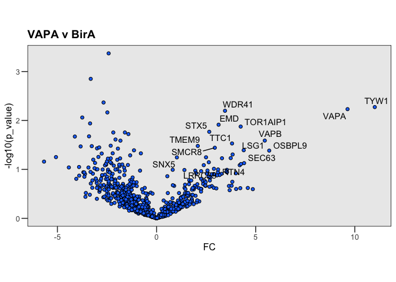
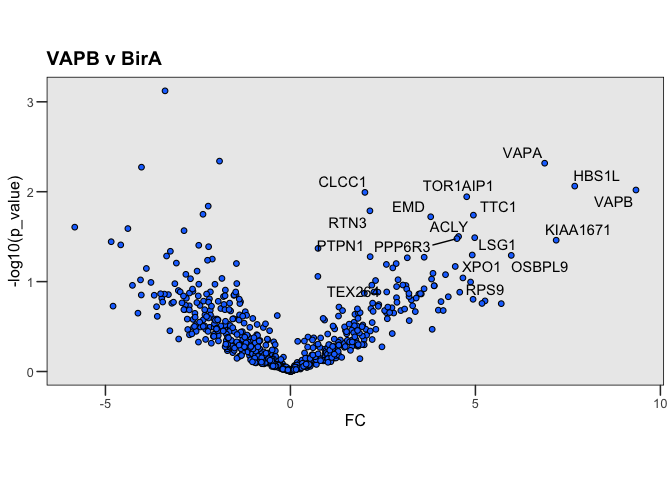
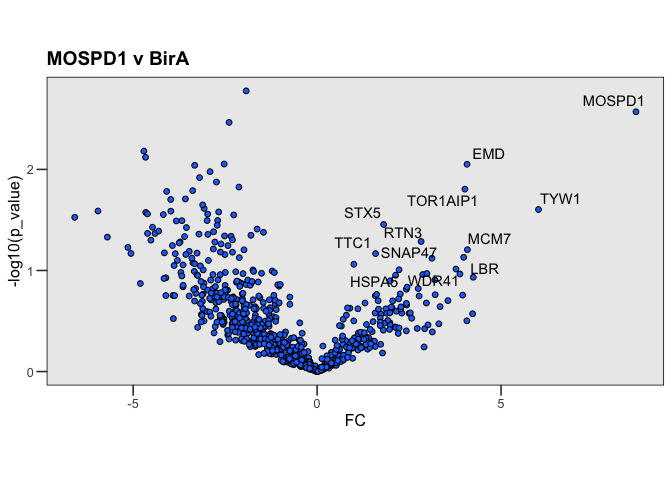
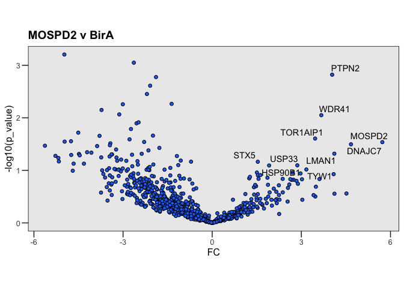
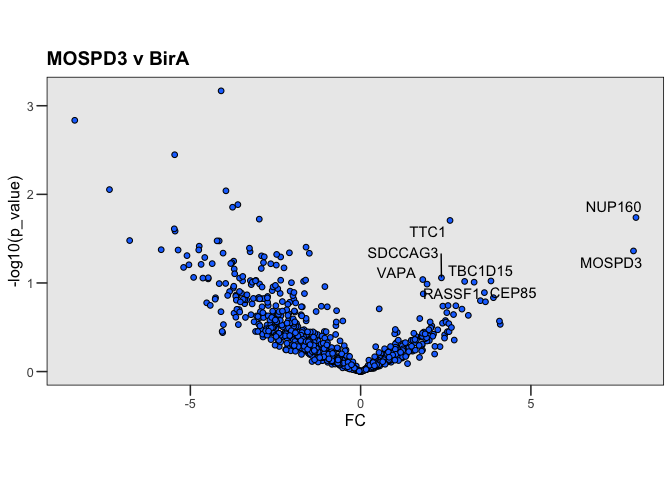

Vapome (re)analysis
================
Birol Cabukusta
2026-07-29

## Vapome

Published as “Human VAPome Analysis Reveals MOSPD1 and MOSPD3 as
Membrane Contact Site Proteins Interacting with FFAT-Related FFNT
Motifs”

**Please cite:** Cabukusta et al. 2020 Cell
Rep. <https://www.cell.com/cell-reports/fulltext/S2211-1247(20)31464-9>

This reanalysis of the Vapome project published in 2020, and might lead
to different figures than the original publication. The reanalysis is
meant to ensure that data remains open and accessible (i.e. FAIR). Not
in a dust-collecting hard drive.

    ## 
    ## Attaching package: 'dplyr'

    ## The following objects are masked from 'package:stats':
    ## 
    ##     filter, lag

    ## The following objects are masked from 'package:base':
    ## 
    ##     intersect, setdiff, setequal, union

    ## 
    ## Attaching package: 'gridExtra'

    ## The following object is masked from 'package:dplyr':
    ## 
    ##     combine

    ## [1] 25

    ## [1] -25

#### Volcano plots

<!-- -->

<!-- -->

<!-- -->

<!-- -->

<!-- -->

#### Comparison of all proteins

<!-- -->

Note that the `echo = FALSE` parameter was added to the code chunk to
prevent printing of the R code that generated the plot.

#### Git update

git config http.postBuffer 524288000 git pull & git push git commit -m
“Update files” git pull & git push
